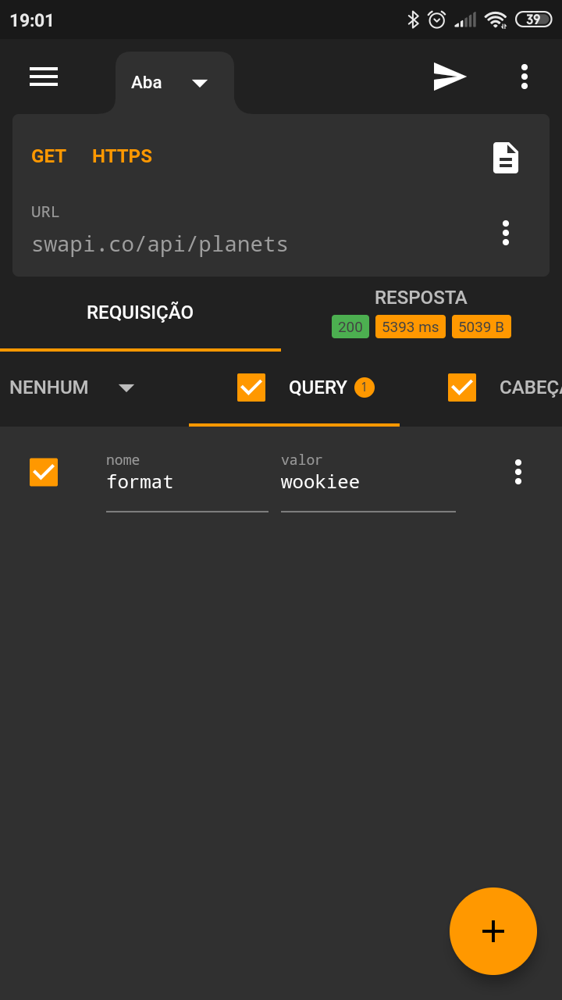
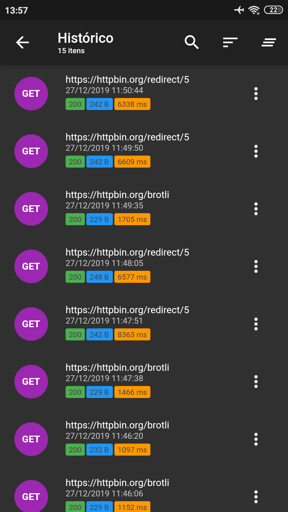
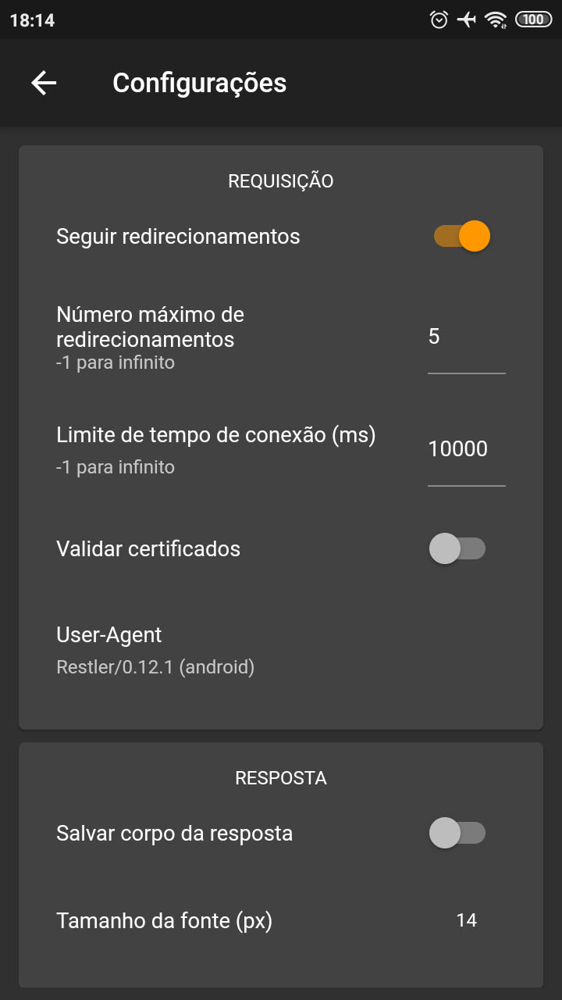

# Restler 

> Restler has been built with simplicity and ease of use in mind. It allows you send custom HTTP/HTTPS requests and test your REST API anywhere and anytime.

#### Download

#### Features

 * Requests you send are automatically saved so that you can come back and review at any time;
 * Save and organize your requests in folders and load requests without writing its attributes again;
 * Favorite requests and folders so they can be shown at the top and accessed quickly;
 * Edit body, url parameters and headers attributes easily;
 * Parses and displays the complete raw response including headers, cookies, status, etc;
 * Supports gzip, deflate and brotli decompression formats;
 * Restler supports the most common HTTP methods (GET, POST, PUT, DELETE, HEAD, PATCH, OPTIONS) and custom methods;
 * Supports Basic, Bearer Token, Hawk and Digest authentication methods;
 * Import collections from Postman, Insomnia (JSON and YAML) or Restler format;
 * Export collections to Postman, Insomnia (JSON) or Restler format;
 * Manage cookies and send them with your request;
 * Quickly copy the response body, headers e cookies received;
 * Autocompletes headers with commonly-used values;
 * Switch easily between HTTP, HTTPS e HTTP2;
 * Beautify the response body received;
 * Use tabs to keep multiple requests open at the same time and switch between them without losing data;
 * Add Client Certificates, Proxy servers and DNS resolvers;
 * Response Caching (RFC 7234);
 * WebSocket & SSE;
 * Workspace;
 * Environment Variables;

#### Screenshots

|                 |                 |                 |
| --------------- | --------------- | --------------- |
|  |  |  |
|  |  |  |

#### Changelog
* `0.17.x`
  * Now, it is open source!!! 🎉
  * Added Connection pool (HTTP session) support 🎉;
  * Added option to keep equal sign for empty query;
  * Added Simplified Chinese translation (Thanks @joytou);
  * Added support to choose directory when exporting a collection;
  * Bug fixes.

* `0.16.x`
  * Added support to Workspaces 🎉;
  * Added support to Environment Variables 🎉;
  * Minor bug fixes;

* `0.15.x`
  * Added support to Response Caching (RFC 7234) 🎉;
  * Added support to SSE (Server-Sent Event) 🎉;
  * Added option to enable cache per request;
  * Added option to enable/disable cookies;
  * Minor bug fixes;

* `0.14.x`
  * Added support to DNS 🎉;
  * Added Timeline feature to Response tab;
  * Optimized to display large response body;
  * Minor bug fixes;

* `0.13.x`
  * Added support to Brotli decompression format 🎉;
  * Minor bug fixes;

* `0.12.x`
  * Added support to proxy 🎉;
  * Added request settings;
  * Added option to configure send cookies per request;
  * Added option to configure store cookies per request;
  * Added support to WebSocket (beta);
  * Minor bug fixes;

* `0.11.x`
  * Added support to import/export Postman collection 🎉;
  * Minor bug fixes;

* `0.10.x`
  * Added support to select & copy the response body 🎉;
  * Added support to import collection from URL;
  * Added support to import collection within a folder;
  * Added support to HTTP2 (experimental);
  * Added support to client certificates;
  * Added support to import/export Restler format (supports encryption);
  * Added light theme 🌞;
  * New HTTP Client library;
  * Added Latin Spanish language (thanks @taksumaki);
  * Added option to change request's User-Agent;
  * Added option to choose request body content-type;
  * Made various UI enhancements;
  * Improved performance;
  * Made various bug fixes.

* `0.9.x`
  * Added support to multiple tabs;
  * Added ability to restore automatically last tabs on startup;
  * Improved performance;
  * Minor UI fixes;
  * Minor bug fixes.

* `0.8.x`
  * Added ability to choose which cookie will be sent;
  * Added ability to not save requests to history;
  * Added ability to save response body as file;
  * Added support to limit the history size;
  * Added donation button to support this app development;
  * Added new logo;
  * Minor UI fixes;
  * Minor bug fixes.

* `0.7.x`
  * Added option in Settings to allow send requests over Wi-Fi only;
  * Added support for responses that return images (JPEG, PNG, SVG, WEBP);
  * Minor UI fixes;
  * Minor bug fixes.

* `0.6.x`
  * Added Digest authentication method;
  * Added ability to beautify the response body for JSON;
  * Added ability to copy headers and cookies values from response;
  * Added support to automatically handle request redirects;
  * Added max redirects option in Settings;
  * Added option to disable following redirects in Settings;
  * Minor bug fixes;
  * Minor UI fixes;

* `0.5.x`
  * Added ability to syntax highlight the response body for JSON;
  * Added Brazilian Portuguese language;
  * Minor bug fixes;
  * Minor UI fixes.

* `0.4.x`
  - Added support to manage cookies;
  - Added support to import cookies from Insomnia;
  - Added support for exporting Insomnia formats;
  - Minor bug fixes;
  - Minor UI fixes;

* `0.3.x`
  - Added ability to duplicate requests;
  - Added autocomplete support for header fields;
  - Added support for importing Insomnia formats;
  - Added option to reset file for Multipart Form field;
  - Added support for custom HTTP methods;
  - Added Hawk authentication method;
  - Added ability to hide keyboard if user clicks out of input;
  - Minor bug fixes.

* `0.2.x`
  - Added Multipart, Form Url Encoded and Binary File Request Body Type;
  - Added button to cancel the current request;
  - Added numeric counter on Request's Body tab;
  - Minor bug fixes.

* `0.1.x`
  * Initial Release.

#### Privacy Policy

[LINK](http://restler.tiagohm.dev/privacy-policy.html)