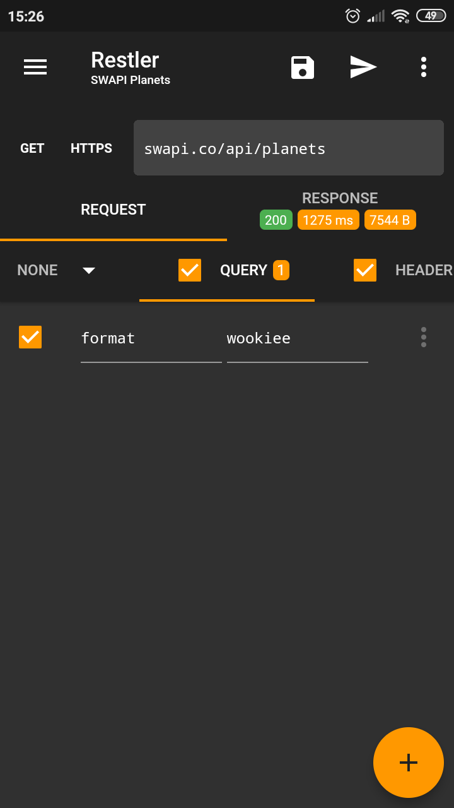
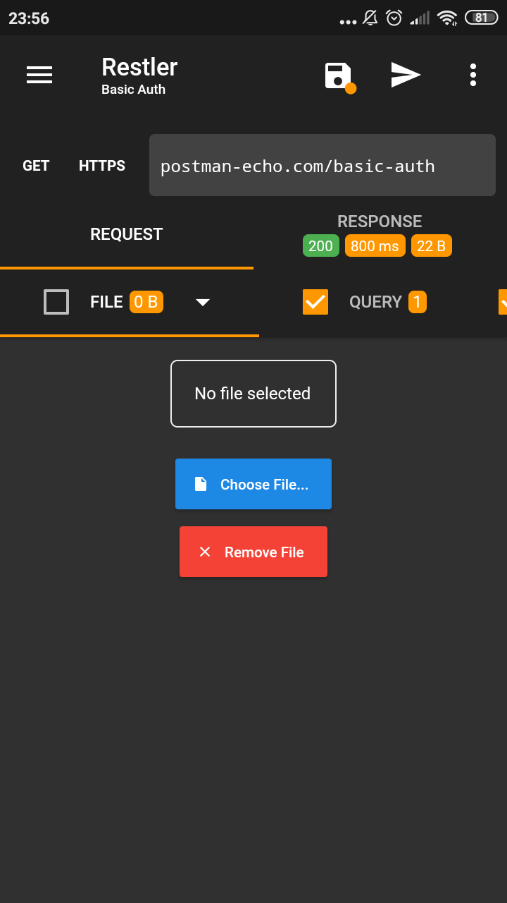
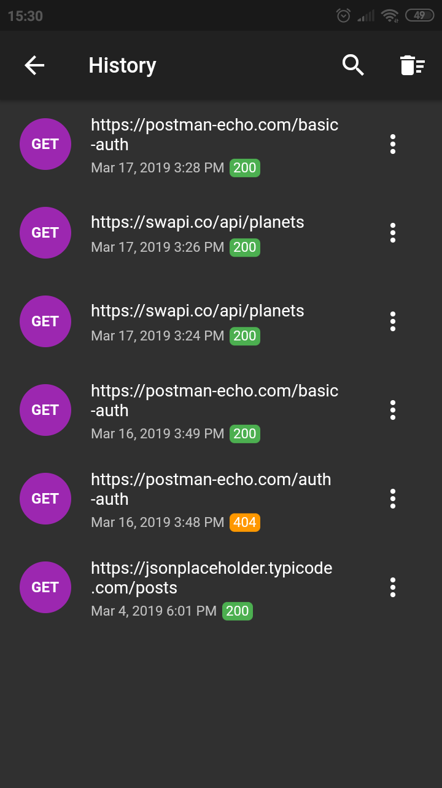
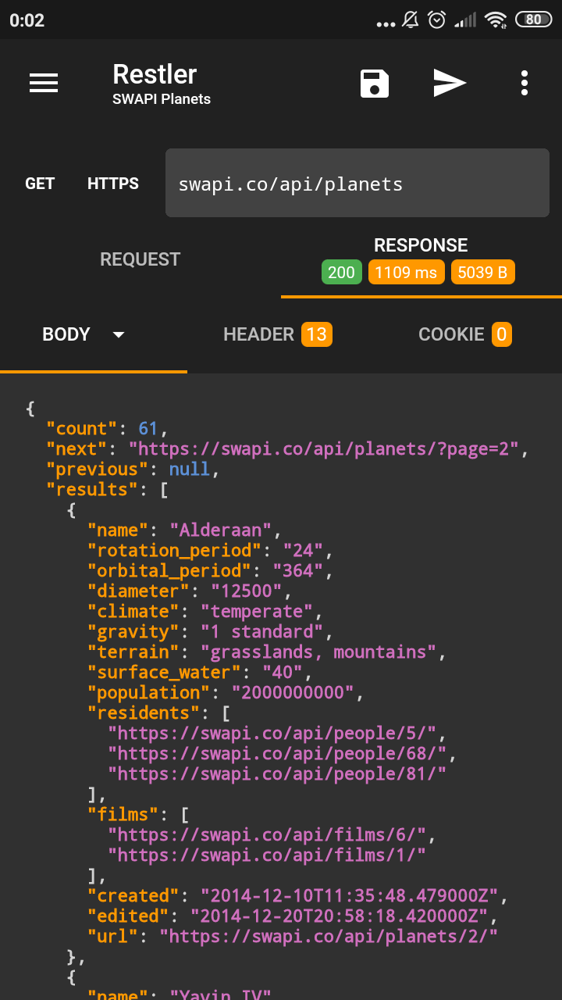
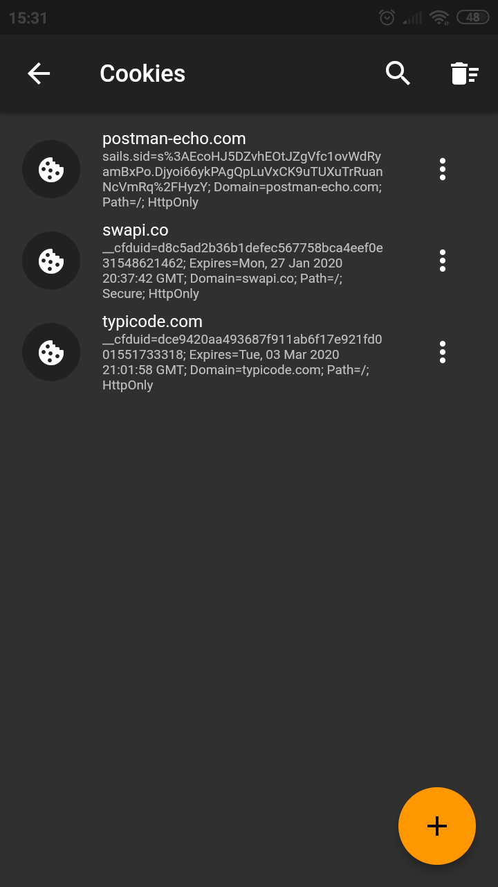

# Restler 

> Restler has been built with simplicity and ease of use in mind. It allows you send custom HTTP/HTTPS requests and test your REST API anywhere and anytime.

#### Download

#### App Features

* Requests you send are automatically saved so that you can come back and review at any time;
* Save and organize your requests in folders and load requests without writing its attributes again;
* Favorite requests and folders so they can be shown at the top and accessed quickly;
* Edit body, url parameters and headers attributes easily;
* Parses and displays the complete raw response including headers, cookies, status, etc;
* Supports the most common HTTP methods (GET, POST, PUT, DELETE, HEAD, PATCH, OPTIONS) and custom methods;
* Supports Basic, Bearer Token, Hawk and Digest Authentication;
* Import collections from Insomnia;
* Export collections to Insomnia;
* Manage cookies and send them with your request;
* Autocompletes headers with commonly-used values;
* Quickly copy the response body, headers and cookies received;
* Switch easily between HTTP and HTTPS;
* Beautify the response body received.

#### Screenshots

|                |                |                |
| -------------- | -------------- | -------------- |
|  |  |  |
|  |  |  |

#### Changelog

* `1.0.0-beta8`
  * Added ability to choose which cookie will be sent;
  * Added ability to not save requests to history;
  * Added ability to save response body as file;
  * Added support to limit the history size;
  * Added donation button to support this app development;
  * Added new logo;
  * Minor UI fixes;
  * Minor bug fixes.

* `1.0.0-beta7`
  * Added option in Settings to allow send requests over Wi-Fi only;
  * Added support for responses that return images (JPEG, PNG, SVG, WEBP);
  * Minor UI fixes;
  * Minor bug fixes.

* `1.0.0-beta6`
  * Added Digest authentication method;
  * Added ability to beautify the response body for JSON;
  * Added ability to copy headers and cookies values from response;
  * Added support to automatically handle request redirects;
  * Added max redirects option in Settings;
  * Added option to disable following redirects in Settings;
  * Minor bug fixes;
  * Minor UI fixes;

* `1.0.0-beta5`
  * Added ability to syntax highlight the response body for JSON;
  * Added Brazilian Portuguese translation;
  * Minor bug fixes;
  * Minor UI fixes.

* `1.0.0-beta4`
  - Added support to manage cookies;
  - Added support to import cookies from Insomnia;
  - Added support for exporting Insomnia formats;
  - Minor bug fixes;
  - Minor UI fixes;

* `1.0.0-beta3`
  - Added ability to duplicate requests;
  - Added autocomplete support for header fields;
  - Added support for importing Insomnia formats;
  - Added option to reset file for Multipart Form field;
  - Added support for custom HTTP methods;
  - Added Hawk authentication method;
  - Added ability to hide keyboard if user clicks out of input;
  - Minor bug fixes.

* `1.0.0-beta2`
  - Added Multipart, Form Url Encoded and Binary File Request Body Type;
  - Added button to cancel the current request;
  - Added numeric counter on Request's Body tab;
  - Minor bug fixes.

* `1.0.0-beta1`
  * Initial Release.

#### Privacy Policy

[LINK](http://restler.tiagohm.xyz/privacy-policy.html)
